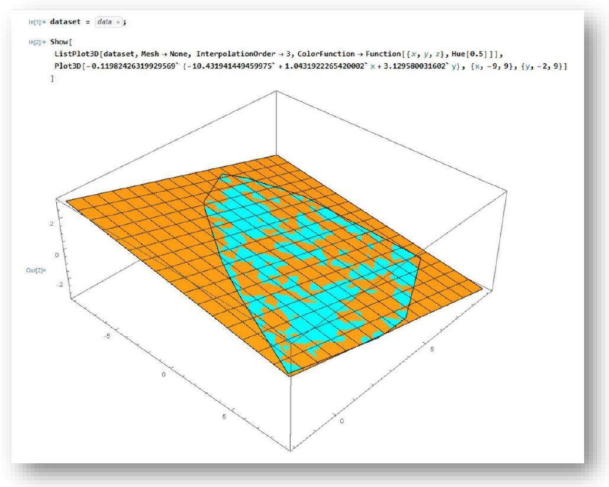

# Ransac Algorithm
A little naive implementation of the Ransac algorithm applied to a datset that describes a plane

## Result view
Using wolfram mathematica, a plot of the plane described by the dataset (in blue), and a possible equation (in orange) gotten from the ransac algorithm is show below: 
